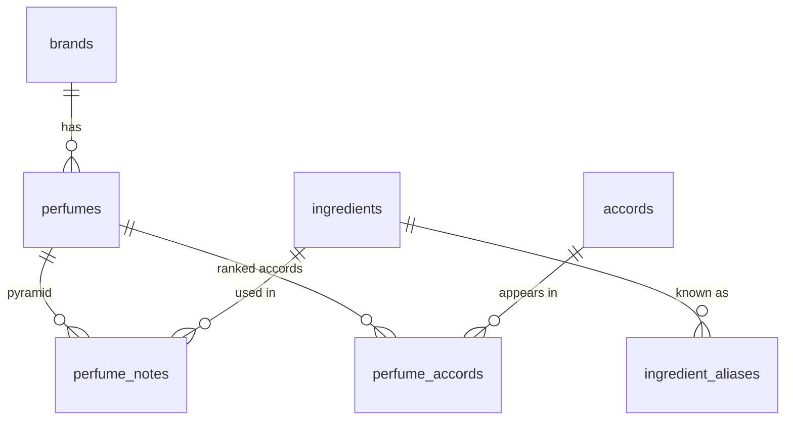

# Perfume Web App - Data Analytics & Community Archivist

A full-stack application designed for advanced filtering, exploration, and data analysis of the perfumery world. This project combines algorithmic web scraping with public datasets to map the relationships between brands, olfactory notes, and accord intensities.

---

## Project Architecture

The project is structured as a decoupled application with two independent main modules:

```text
📂 perfume-web-app
 ┣ 📂 backend  --> REST API Server built with Java 21 + Spring Boot + JPA
 ┗ 📂 client   --> User Interface (UI) built with React + Vite + TypeScript

```

### The Backend (Java + Spring Boot)

The business logic, entity relationships, and REST APIs are handled by a backend built on Java 21 leveraging the Spring Boot ecosystem.

* **Persistence:** Managed via Spring Data JPA and Hibernate for automatic mapping of object-oriented models to the relational database.
* **Database:** PostgreSQL, optimized for complex queries and structured JOIN operations between perfumes, accords, and olfactory pyramids.

### The Client (React + Vite + TypeScript)

The graphical interface is a modern, responsive, and strongly typed Single Page Application (SPA).

* The build infrastructure is powered by Vite to guarantee fast hot-reloading during development.
* Communication with the backend is performed through asynchronous HTTP requests handled via Axios.

---

## Data Sources & Datasets

The application's knowledge base normalizes and merges three distinct data sources, combining static open-source data with custom web scraping operations:

### 1. Première Peau (Glossary & Raw Materials)

* **Data:** Technical raw materials information, olfactory families, and terminology definitions.
* **Method:** Data extracted using a custom scraper developed in Node.js (with Puppeteer) targeting the public resources of Première Peau.

### 2. Fragrantica.com (Extended Catalog)

* **Data:** A massive volume of perfumes, complete olfactory pyramids, user reviews, and main accord weights.
* **Method:** Integration of the historical public dataset available on Kaggle:
https://www.kaggle.com/datasets/olgagmiufana1/fragrantica-com-fragrance-dataset

### 3. Parfumo.net (Perfumes & Brand Core)

* **Data:** Detailed information on seasonal releases, niche/independent brands, and structured notes.
* **Method:** Integration of community-curated data made available through the TidyTuesday project:
https://github.com/rfordatascience/tidytuesday/blob/main/data/2024/2024-12-10/readme.md

---

## System Requirements

To run the full stack environment locally, the following prerequisites are required:

* Java SDK 21 or higher
* Node.js (v20+ recommended for the client module)
* Active PostgreSQL Server instance


> This project is developed for educational purposes to study modern enterprise architecture with Java while addressing data normalization challenges from heterogeneous sources.


 ## Database Architecture & Schema

The database (PostgreSQL) is rebuilt from the three source datasets by `import_datasets.js`,
which runs `schema.sql` — the **single source of truth for the schema** — before loading any data.
Every dimension (brand, ingredient, accord) is deduplicated by a **normalized key**, so the same
value written differently across sources (`Cedar` / `Cedarwood`, `W.Dressroom` / `W Dressroom`)
collapses into a single row.

The schema is designed around four search axes:

* **by brand**, **by ingredient**, **by accord** → id-based lookups (dimension tables + foreign keys);
* **by name** → text search (trigram indexes on `perfumes.title` and `ingredients.name`).

### Entity-Relationship Overview



### Tables

#### 1. `brands`
Fragrance houses, deduplicated across sources.

| Column | Type | Notes |
|---|---|---|
| `id` | `BIGINT` | PK, identity |
| `name` | `VARCHAR(255)` | Display name (first spelling seen wins) |
| `name_normalized` | `VARCHAR(255)` | **UNIQUE** — dedup key |
| `created_at` | `TIMESTAMPTZ` | Defaults to `now()` |

#### 2. `ingredients` (Raw-Material & Note Vocabulary)
Canonical list of raw materials / olfactory notes. Rich rows come from the Première Peau glossary
(`from_glossary = true`); thin rows are created on demand for notes that appear only in
Fragrantica / Parfumo.

| Column | Type | Notes |
|---|---|---|
| `id` | `BIGINT` | PK, identity |
| `name` | `VARCHAR(255)` | Canonical display name (e.g. *Bergamot*) |
| `name_normalized` | `VARCHAR(255)` | **UNIQUE** — dedup key |
| `category` / `subcategory` | `VARCHAR(255)` | Classification taxonomy |
| `botanical_name` | `VARCHAR(255)` | Scientific / botanical name |
| `typical_volatility` | `VARCHAR(255)` | Top / Heart / Base tendency |
| `odor_strength` | `VARCHAR(255)` | Sensory intensity rating |
| `short_description` / `appearance` / `producing_countries` | `TEXT` | Descriptive fields |
| `evolution_immediate` / `evolution_after_hours` / `evolution_after_days` | `TEXT` | Sensory evolution over time |
| `full_extracted_text` | `TEXT` | Full glossary text |
| `source_url` | `TEXT` | Origin URL |
| `from_glossary` | `BOOLEAN` | `true` = rich glossary entry, `false` = note-only entry |
| `created_at` | `TIMESTAMPTZ` | Defaults to `now()` |

#### 3. `ingredient_aliases`
Maps every surface form of an ingredient to its canonical row, so a search-by-note resolves
any spelling (`cedar`, `cedarwood`, `sicilian bergamot`) to a single ingredient id.

| Column | Type | Notes |
|---|---|---|
| `alias_normalized` | `VARCHAR(255)` | PK — a normalized surface form |
| `ingredient_id` | `BIGINT` | FK → `ingredients.id` (`ON DELETE CASCADE`) |

#### 4. `accords`
Dimension table for the main olfactory accords, so accords are an **id-based** search axis
(symmetric to brands and ingredients).

| Column | Type | Notes |
|---|---|---|
| `id` | `BIGINT` | PK, identity |
| `name` | `VARCHAR(100)` | Display name (e.g. *citrus*, *woody*) |
| `name_normalized` | `VARCHAR(100)` | **UNIQUE** — dedup key |

#### 5. `perfumes`
One row per real fragrance, deduplicated across sources by `(brand_id, title_normalized)`.

| Column | Type | Notes |
|---|---|---|
| `id` | `BIGINT` | PK, identity |
| `brand_id` | `BIGINT` | FK → `brands.id` (`ON DELETE CASCADE`) |
| `title` | `VARCHAR(255)` | Perfume name |
| `title_normalized` | `VARCHAR(255)` | Dedup key |
| `description` | `TEXT` | Free-text description (from Fragrantica) |
| `release_year` | `INTEGER` | Launch year (from Parfumo) |
| `perfumer` | `VARCHAR(255)` | Nose behind the fragrance (from Parfumo) |
| `created_at` | `TIMESTAMPTZ` | Defaults to `now()` |
| | | **UNIQUE** `(brand_id, title_normalized)` |

#### 6. `perfume_notes` (Olfactory Pyramid — junction)
Many-to-many link between perfumes and ingredients. The **UNIQUE** constraint is what actually
prevents duplicate links.

| Column | Type | Notes |
|---|---|---|
| `id` | `BIGINT` | PK, identity |
| `perfume_id` | `BIGINT` | FK → `perfumes.id` (`ON DELETE CASCADE`) |
| `ingredient_id` | `BIGINT` | FK → `ingredients.id` (`ON DELETE CASCADE`) |
| `layer` | `VARCHAR(20)` | `top` \| `heart` \| `base` |
| | | **UNIQUE** `(perfume_id, ingredient_id, layer)` |

#### 7. `perfume_accords` (Ranked Accords — junction)
Many-to-many link between perfumes and accords. `rank` preserves the dominance order reported
by the sources (**1 = most dominant**); there is no fabricated percentage.

| Column | Type | Notes |
|---|---|---|
| `id` | `BIGINT` | PK, identity |
| `perfume_id` | `BIGINT` | FK → `perfumes.id` (`ON DELETE CASCADE`) |
| `accord_id` | `BIGINT` | FK → `accords.id` (`ON DELETE CASCADE`) |
| `rank` | `SMALLINT` | Dominance position, 1 = strongest |
| | | **UNIQUE** `(perfume_id, accord_id)` |

### Indexes

* `idx_perfume_notes_ingredient` on `perfume_notes(ingredient_id)` — search perfumes by note;
* `idx_perfume_accords_accord` on `perfume_accords(accord_id)` — search perfumes by accord;
* `idx_perfumes_brand` on `perfumes(brand_id)` — list a brand's perfumes;
* GIN trigram indexes on `perfumes.title` and `ingredients.name` (extension `pg_trgm`) — name search.

### How the data is loaded

`import_datasets.js` rebuilds everything from scratch on every run (`schema.sql` drops and
recreates all tables — the data is 100% re-derivable from the source files), in three stages:

1. **Première Peau glossary** → canonical, rich `ingredients`;
2. **Parfumo** → `perfumes`, notes (authoritative source), and accords;
3. **Fragrantica** → merges into existing perfumes, fills `description`, adds accords, and adds
    notes only as a fallback for perfumes that still have none.