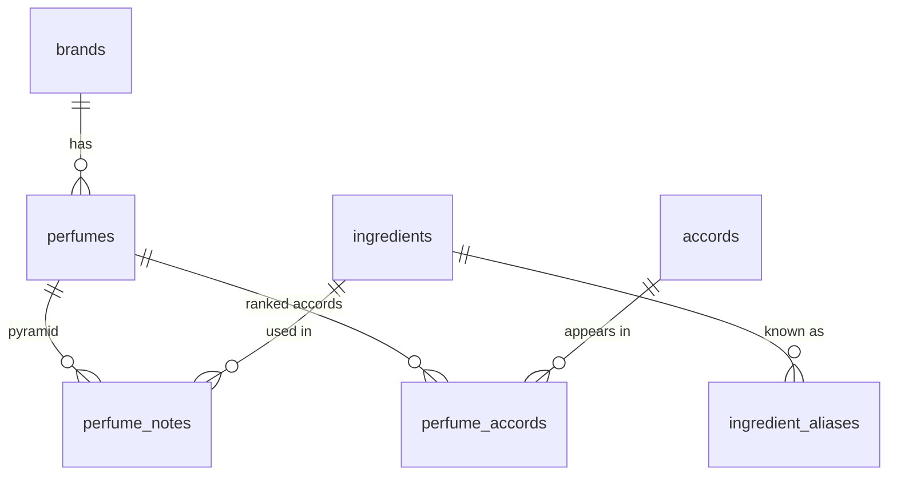

# Perfume Web App

Full-stack app to **browse, search and curate** a perfume & raw-material database, built by merging
three sources (Première Peau, Fragrantica, Parfumo) into a single normalized PostgreSQL schema.

- **Browse** raw materials (ingredients) A–Z and inspect each one.
- **Browse** perfume houses (brands) A–Z with their perfumes, and inspect each perfume's
  olfactory pyramid and ranked accords.
- **Search** perfumes and ingredients from the header (trigram autocomplete).
- **Edit** ingredient and perfume text fields inline and persist them to the DB.

> The database itself is **built by the companion repo** > [`scraper-perfumes`](https://github.com/gpaparaz/scraper-perfumes) (`schema.sql` +
> `import_datasets.js`).
> This app **reads and edits** that database; it does not create the schema.

---

## Architecture

```text
📂 perfume-web-app
┣ 📂 backend   --> REST API — Java 21 + Spring Boot + Spring Data JPA (Hibernate)
┗ 📂 client    --> SPA — React + Vite + TypeScript + Bootstrap 5
```

- **Backend**: layered `controller → service → repository → model`, with `dto` for responses and
  a global `config/CorsConfig`. Persistence via Spring Data JPA on **PostgreSQL**.
- **Client**: React SPA, routing with React Router, HTTP via Axios, styling with Bootstrap.

---

## Requirements

- Java SDK **21+**
- Node.js **20+**
- A running **PostgreSQL** instance already populated by
  [`scraper-perfumes`](https://github.com/gpaparaz/scraper-perfumes)
  (the schema needs the `pg_trgm` extension, which `schema.sql` enables — required for search).

---

## Getting started

**1. Database** — build/populate it first from the scraper repo (`node import_datasets.js`), which
drops & recreates the schema and loads the three datasets.

**2. Backend**

```bash
cd backend
./mvnw spring-boot:run        # starts on http://localhost:8080
```

**3. Client**

```bash
cd client
npm install
npm run dev                   # starts on http://localhost:5173
```

<!-- ---

## Configuration

**Backend** — `backend/src/main/resources/application.properties`:
```properties
spring.datasource.url=jdbc:postgresql://localhost:5432/postgres
spring.datasource.username=postgres
spring.datasource.password=YOUR_PASSWORD
spring.jpa.hibernate.ddl-auto=validate        # the schema is owned by scraper-perfumes; the app
only validates
app.cors.allowed-origins=http://localhost:5173 # comma-separated list of allowed client origins
```
> `ddl-auto=validate`: the app checks its entities against the existing tables and refuses to start
> if they diverge — it never alters the schema.

**Client** — `client/.env`:
```
VITE_API_BASE_URL=http://localhost:8080/api
``` -->

---

## REST API

Base path: `/api`

| Method         | Endpoint                        | Description                                                      |
| -------------- | ------------------------------- | ---------------------------------------------------------------- |
| `GET`          | `/ingredient`                   | Ingredient summaries (the A–Z glossary list)                     |
| `GET`          | `/ingredient/{id}`              | Full ingredient detail                                           |
| `PUT`          | `/ingredient/{id}`              | Update an ingredient's text fields (name/identity are read-only) |
| `GET`          | `/perfumes/{letter}`            | **Brands** whose name starts with `{letter}`, each with its      |
| perfumes       |
| `GET`          | `/perfumes/detail/{id}`         | Full perfume detail: brand, notes pyramid (top/heart/base),      |
| ranked accords |
| `PUT`          | `/perfumes/{id}`                | Update a perfume's text fields (title/brand are read-only)       |
| `GET`          | `/search/perfumes?q=&limit=`    | Autocomplete perfumes by title (trigram)                         |
| `GET`          | `/search/ingredients?q=&limit=` | Autocomplete ingredients by name (trigram)                       |

> Note: `GET /perfumes/{letter}` intentionally returns **brands** (with their perfumes) for the
> A–Z browse page.

---

## Frontend routes

| Route             | Screen             | What it shows                                                      |
| ----------------- | ------------------ | ------------------------------------------------------------------ |
| `/`               | Home               | Landing dashboard                                                  |
| `/ingredient`     | Ingredients list   | A–Z glossary of raw materials / notes                              |
| `/ingredient/:id` | Ingredient inspect | Full sheet + inline edit                                           |
| `/perfumes`       | Brands list        | A–Z brands (accordion) with their perfumes                         |
| `/perfumes/:id`   | Perfume inspect    | Photo, brand, year, nose, accords, olfactory pyramid + inline edit |

A header search bar (mode: perfume / ingredient) provides debounced autocomplete that links to the
matching inspect page.

---

## Data sources

The knowledge base merges three sources (details and loader in
[`scraper-perfumes`](https://github.com/gpaparaz/scraper-perfumes)):

1. **Première Peau** — raw-material glossary (scraped with Puppeteer): the canonical, rich
   ingredient entries.
2. **Fragrantica** — large perfume catalog (Kaggle public dataset): accords, descriptions,
   perfume photos.
3. **Parfumo** — perfumes & brands (TidyTuesday community dataset): structured notes, release year,
   perfumer.

---

## Database schema (overview)

PostgreSQL. Every dimension (brand, ingredient, accord) is deduplicated by a **normalized key**, so
the same value written differently across sources (`Cedar`/`Cedarwood`, `W.Dressroom`/`W Dressroom`)
collapses into one row. Designed around four search axes: **by brand / ingredient / accord**
(id-based,
via dimension tables + FKs) and **by name** (trigram text search).

> Authoritative DDL: `schema.sql` in **scraper-perfumes**. This is a reference overview.


```mermaid
erDiagram
   brands       ||--o{ perfumes           : has
   perfumes     ||--o{ perfume_notes      : "pyramid"
   ingredients  ||--o{ perfume_notes      : "used in"
   perfumes     ||--o{ perfume_accords    : "ranked accords"
   accords      ||--o{ perfume_accords    : "appears in"
   ingredients  ||--o{ ingredient_aliases : "known as"
```

### `brands`

| Column            | Type           | Notes                                   |
| ----------------- | -------------- | --------------------------------------- |
| `id`              | `BIGINT`       | PK, identity                            |
| `name`            | `VARCHAR(255)` | Display name (first spelling seen wins) |
| `name_normalized` | `VARCHAR(255)` | **UNIQUE** — dedup key                  |
| `logo_url`        | `TEXT`         | Brand logo (nullable)                   |
| `created_at`      | `TIMESTAMPTZ`  | Defaults to `now()`                     |

### `ingredients` (raw materials & note vocabulary)

Rich rows come from the Première Peau glossary (`from_glossary = true`); thin rows are created on
demand for notes seen only in Fragrantica / Parfumo.

| Column                                                                   | Type           | Notes                                                   |
| ------------------------------------------------------------------------ | -------------- | ------------------------------------------------------- |
| `id`                                                                     | `BIGINT`       | PK, identity                                            |
| `name`                                                                   | `VARCHAR(255)` | Canonical display name                                  |
| `name_normalized`                                                        | `VARCHAR(255)` | **UNIQUE** — dedup key                                  |
| `category` / `subcategory`                                               | `VARCHAR(255)` | Classification taxonomy                                 |
| `botanical_name`                                                         | `VARCHAR(255)` | Scientific / botanical name                             |
| `typical_volatility`                                                     | `VARCHAR(255)` | Top / Heart / Base tendency                             |
| `odor_strength`                                                          | `VARCHAR(255)` | Sensory intensity rating                                |
| `short_description` / `appearance` / `producing_countries`               | `TEXT`         | Descriptive fields                                      |
| `evolution_immediate` / `evolution_after_hours` / `evolution_after_days` | `TEXT`         | Sensory                                                 |
| evolution over time                                                      |
| `full_extracted_text`                                                    | `TEXT`         | Full glossary text                                      |
| `source_url`                                                             | `TEXT`         | Origin URL                                              |
| `image_url`                                                              | `TEXT`         | Ingredient photo (matched via `ingredient_aliases`)     |
| `from_glossary`                                                          | `BOOLEAN`      | `true` = rich glossary entry, `false` = note-only entry |
| `created_at`                                                             | `TIMESTAMPTZ`  | Defaults to `now()`                                     |

### `ingredient_aliases`

Maps every surface form of an ingredient to its canonical row, so search-by-note resolves any
spelling (`cedar`, `cedarwood`, `sicilian bergamot`) to one ingredient id.

| Column             | Type           | Notes                                       |
| ------------------ | -------------- | ------------------------------------------- |
| `alias_normalized` | `VARCHAR(255)` | PK — a normalized surface form              |
| `ingredient_id`    | `BIGINT`       | FK → `ingredients.id` (`ON DELETE CASCADE`) |

### `accords`

Dimension table so accords are an **id-based** search axis (symmetric to brands and ingredients).

| Column            | Type           | Notes                                 |
| ----------------- | -------------- | ------------------------------------- |
| `id`              | `BIGINT`       | PK, identity                          |
| `name`            | `VARCHAR(100)` | Display name (e.g. _citrus_, _woody_) |
| `name_normalized` | `VARCHAR(100)` | **UNIQUE** — dedup key                |

### `perfumes`

One row per real perfume, deduplicated across sources by `(brand_id, title_normalized)`.

| Column             | Type           | Notes                                               |
| ------------------ | -------------- | --------------------------------------------------- |
| `id`               | `BIGINT`       | PK, identity                                        |
| `brand_id`         | `BIGINT`       | FK → `brands.id` (`ON DELETE CASCADE`)              |
| `title`            | `VARCHAR(255)` | Perfume name                                        |
| `title_normalized` | `VARCHAR(255)` | Dedup key                                           |
| `description`      | `TEXT`         | Free-text description (from Fragrantica)            |
| `release_year`     | `INTEGER`      | Launch year (from Parfumo)                          |
| `perfumer`         | `VARCHAR(255)` | Nose behind the perfume (from Parfumo)              |
| `image_url`        | `TEXT`         | Perfume photo (derived from the Fragrantica URL id) |
| `created_at`       | `TIMESTAMPTZ`  | Defaults to `now()`                                 |
|                    |                | **UNIQUE** `(brand_id, title_normalized)`           |

### `perfume_notes` (olfactory pyramid — junction)

| Column          | Type          | Notes                                           |
| --------------- | ------------- | ----------------------------------------------- |
| `id`            | `BIGINT`      | PK, identity                                    |
| `perfume_id`    | `BIGINT`      | FK → `perfumes.id` (`ON DELETE CASCADE`)        |
| `ingredient_id` | `BIGINT`      | FK → `ingredients.id` (`ON DELETE CASCADE`)     |
| `layer`         | `VARCHAR(20)` | `top` \| `heart` \| `base`                      |
|                 |               | **UNIQUE** `(perfume_id, ingredient_id, layer)` |

### `perfume_accords` (ranked accords — junction)

`rank` preserves the dominance order from the sources (**1 = most dominant**).

| Column       | Type       | Notes                                    |
| ------------ | ---------- | ---------------------------------------- |
| `id`         | `BIGINT`   | PK, identity                             |
| `perfume_id` | `BIGINT`   | FK → `perfumes.id` (`ON DELETE CASCADE`) |
| `accord_id`  | `BIGINT`   | FK → `accords.id` (`ON DELETE CASCADE`)  |
| `rank`       | `SMALLINT` | Dominance position, 1 = strongest        |
|              |            | **UNIQUE** `(perfume_id, accord_id)`     |

### Indexes

- `perfume_notes(ingredient_id)`, `perfume_accords(accord_id)`, `perfumes(brand_id)` — id-based
  lookups;
- GIN trigram indexes on `perfumes.title` and `ingredients.name` (`pg_trgm`) — name search /
  autocomplete.
